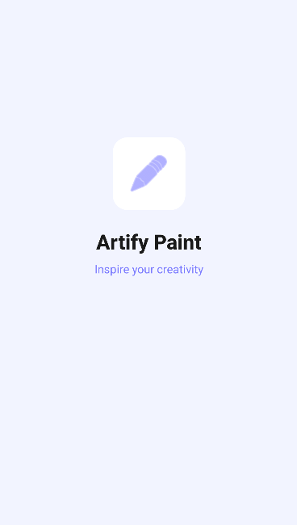
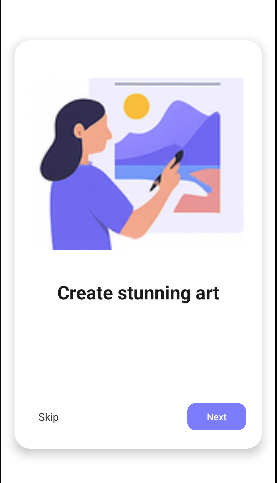
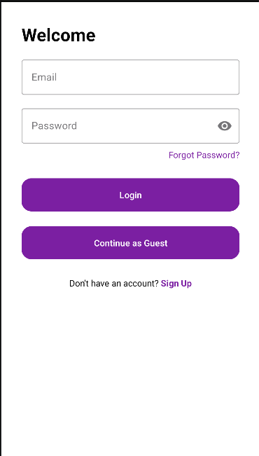
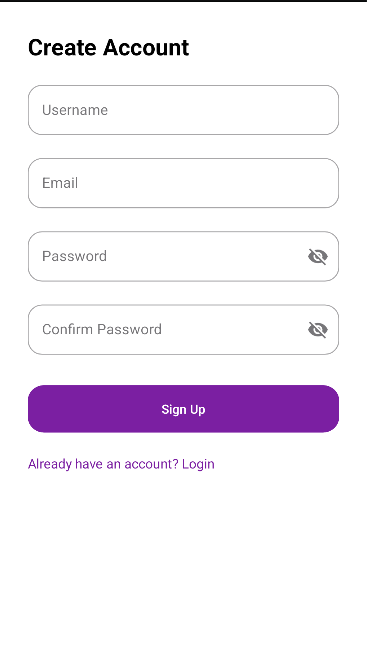
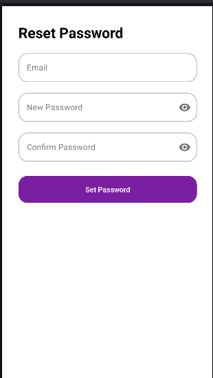
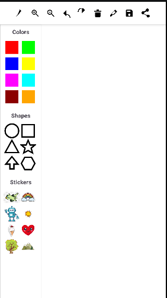

# PaintApp – Android Drawing Application

## Introduction
PaintApp is an Android-based drawing application developed using Android Studio and Kotlin. The app allows users to draw freely on the screen using touch gestures and provides an interactive painting experience through a custom PaintView.

## Project Overview
This project demonstrates the implementation of custom views, canvas drawing, touch event handling, onboarding screens, and user authentication features. It simulates a real-world Android application by combining drawing functionality with login and user management screens.

## Activities Included

- **SplashActivity**  
  Displays the splash screen when the app is launched.  
  

- **OnboardingActivity**  
  Introduces the application features to first-time users.  
  

- **LoginSignupActivity**  
  Provides options for users to log in, continue as a guest, or navigate to the signup screen.  
  

- **SignupActivity**  
  Allows new users to create an account by entering their details.  
  

- **ForgotPasswordActivity**  
  Enables users to reset their password by providing their email and new password.  
  

- **PaintActivity**  
  Provides a drawing interface where users can draw freely using touch gestures. Users can zoom in and out, adjust brush size, undo and redo actions, and add stickers, shapes, or paint freely.  
  

## Features
- Freehand drawing using touch input
- Custom PaintView implemented using Canvas and Paint
- Shape handling through `Shape.kt`
- Onboarding screens for new users
- User authentication UI (Login, Signup, Forgot Password)
- Clean and user-friendly interface

## Tools & Technologies
- Android Studio
- Kotlin
- XML (ConstraintLayout)
- Material UI Components
- Canvas & Paint API

## Project Structure
- `PaintView.kt` – Custom drawing view
- `Shape.kt` – Shape handling logic
- `PaintActivity.kt` – Drawing screen
- `SplashActivity.kt` – Splash screen
- `OnboardingActivity.kt` – Introductory screens
- `LoginSignupActivity.kt` – Login navigation
- `SignupActivity.kt` – User registration
- `ForgotPasswordActivity.kt` – Password recovery  
